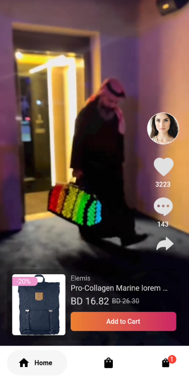
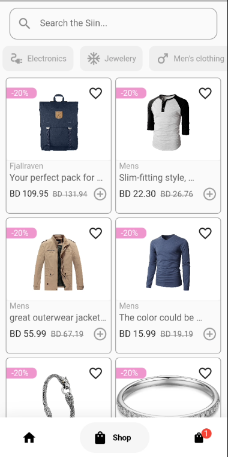
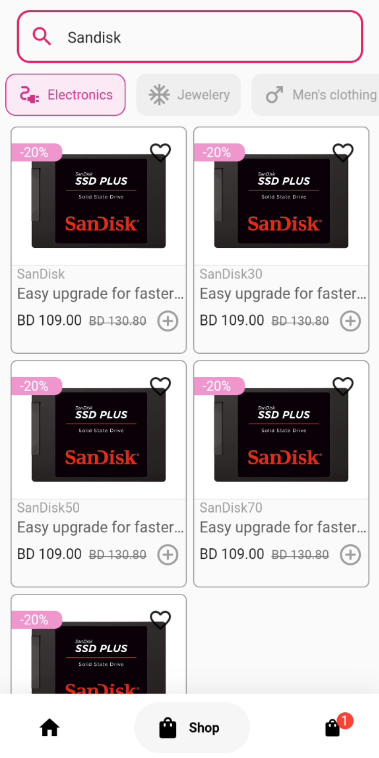
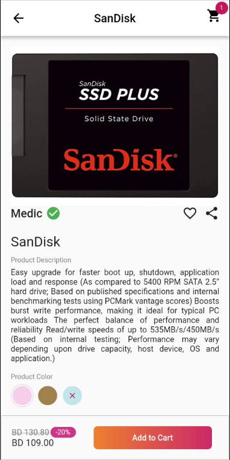
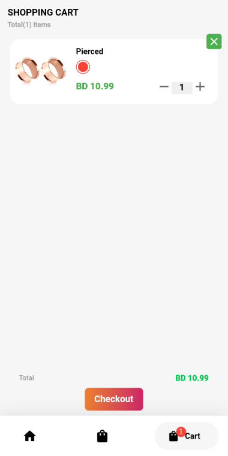

# Siin Shop Demo

## Table of Contents
- [Preview](#preview)
- [Features](#features)
- [Project Dependency](#dependency)
- [Project Structure](#structure)
- [How to Setup](#setup)
- [Prerequisites](#prerequisites)
- [Installation](#installation)
- [Running the Project](#running-the-project)
- [How to interect](#interact)

## Preview

Download the Apk

You can download the latest version of the app from the following link:
- [Download APK](https://github.com/naimurhasan/flutter_siin_shop/releases/download/release/flutter-siin-shop-1.apk)

<table>
  <tr>
    <td>
       
    <p>Siin Shoop Demo App built With Flutter<br/>
      </p>
    </td>
  </tr>
</table>
<table>
  <tr>
     <td>Home</td>
     <td>Category</td>
     <td>Search Or Filter</td>
  </tr>
  <tr>
    <td></td>
    <td></td>
    <td></td>
  </tr>
  <tr>
     <td>Product Detail</td>
     <td>Cart</td>
     <td> </td>
  </tr>
  <tr>
    <td></td>
    <td></td>
    <td></td>
  </tr>
 </table>

## Features
|   | Feature |
|---|-----------|
| ✔️ | Home Video Feed |
| ✔️ | Category |
| ✔️ | Product Detail |
| ✔️ | Cart |

## State Management: BLoC

Stacked | MVVM

#### Versions

- [fstacked](https://pub.dev/packages/stacked) - version 3.4.1

## Dependency
Project Project
- Flutter version: [](https://flutter.dev/)<br/>

    -- Framework • revision f72efea43c (3 months ago) • 2023-04-11 11:57:21 -0700<br/>

    -- Engine • revision 1a65d409c7<br/>

    -- Tools • Dart 2.19.6 • DevTools 2.20.1
- Java version: [](https://www.java.com/)


## Structure
Project Structure
```
│   main.dart
├───constants
├───models
├───repositories
├───screens
├───utils
└───widgets
```

# Setup
How to setup

## Prerequisites

Before you can set up and run this project locally, ensure that you have the following prerequisites installed on your machine:

- Flutter SDK [Install Flutter](https://flutter.dev/docs/get-started/install)

## Installation

1. Clone this repository to your local machine using the following command:

```git clone https://github.com/your-username/project-name.git```

2. Navigate to the project directory:

```cd flutter_siin_shop```

3. Install the project dependencies by running the following command:

flutter pub get

## Running the Project

To run the project locally, follow these steps:

1. Ensure that you have a simulator/emulator or a physical device connected to your machine.

2. Start the simulator/emulator or connect your physical device.

3. Run the project using the following command:

```flutter run```

This will build and launch the app on the connected device.

## Interact
How to interect with each operation:
1. Home View:
    - You can swipe up / down to check video feed
    - add product to cart
2. Category View
    - Search on the searchbar
    - select a category for filter, tap on the same cat for unselect
    - By click + button product can be added to cart
3. Product Detail View
    - Can add to Cart with button
    - Navigate to Cart Page from Here
4. Cart View
    - Can increment quanitty
    - Or remove the product

## Getting Started with Flutter?

This project is a starting point for a Flutter application.

A few resources to get you started if this is your first Flutter project:

- [Lab: Write your first Flutter app](https://docs.flutter.dev/get-started/codelab)
- [Cookbook: Useful Flutter samples](https://docs.flutter.dev/cookbook)

For help getting started with Flutter development, view the
[online documentation](https://docs.flutter.dev/), which offers tutorials,
samples, guidance on mobile development, and a full API reference.
